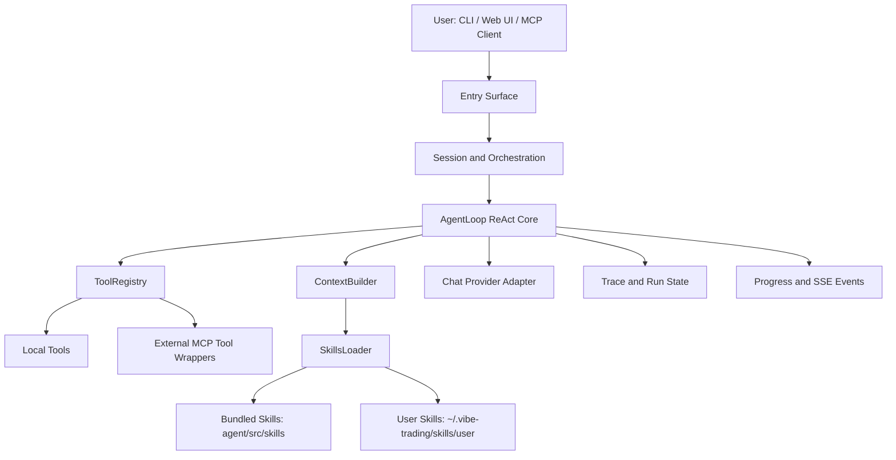

# Vibe-Trading Architecture (AI Agent + Skills Focus)

This document explains the architecture of the AI agent runtime and skill system in this repository, with an implementation-first view based on the current code.

## 1. Scope and Orientation

The project has multiple areas, but the agent and skill core lives mainly under:

- `agent/src/agent/`: agent loop, context building, memory, skill loading, tracing
- `agent/src/tools/`: tool implementations and registry/discovery
- `agent/src/skills/`: bundled skill knowledge base (`SKILL.md` files)
- `agent/src/session/`: session orchestration for chat/API execution
- `agent/mcp_server.py`: MCP-facing tool surface
- `agent/api_server.py`: REST/SSE service layer
- `agent/cli/`: interactive terminal front door

## 2. High-Level Agent Runtime

At runtime, the agent is a ReAct-style loop that repeatedly:

1. Builds/updates context and system prompt.
2. Calls the model (streaming).
3. Executes tool calls (batched with read/write policy).
4. Feeds tool results back to the model.
5. Stops when a final answer is produced or a terminal condition occurs.

Core implementation: `agent/src/agent/loop.py` (`AgentLoop`).

## 3. Layered Architecture



## 4. Entry Surfaces and Shared Core

### CLI

- `agent/cli/main.py` handles interactive routing and startup.
- It ultimately uses the same backend stack (session service + agent loop + tools).

### API/Web

- `agent/api_server.py` provides REST + SSE endpoints.
- Message execution flows through `SessionService`.

### MCP Server

- `agent/mcp_server.py` exposes MCP tools directly.
- Skill-specific MCP tools include `list_skills()` and `load_skill(name)`.

Important architecture point: all surfaces reuse common internals (`AgentLoop`, `ToolRegistry`, `SkillsLoader`, providers), so behavior is mostly consistent across CLI/API/MCP.

## 5. Session to Agent Execution Path

Primary orchestration is in `agent/src/session/service.py`:

1. Persist user message to session store.
2. Create an execution attempt.
3. Build runtime config (`load_runtime_agent_config`).
4. Build tool registry (`build_registry(...)`).
5. Construct `AgentLoop` with `ChatLLM` and persistent memory.
6. Run loop in a managed thread pool.
7. Stream events to SSE event bus and persist final assistant message.

This separation keeps transport concerns (HTTP/SSE/session lifecycle) outside the core ReAct logic.

## 6. AgentLoop Design (ReAct Core)

`AgentLoop` in `agent/src/agent/loop.py` includes several robustness mechanisms:

- Streaming model calls with retry on retryable provider stream failures.
- Cooperative cancel support (`cancel()` checked at multiple checkpoints).
- Iteration cap and wrap-up nudges near max iterations.
- Tool call duplicate protection for non-repeatable tools.
- Per-tool timeout behavior:
  - Read-only tools: bounded timeout and safe error return.
  - Write tools: warn on timeout but allow completion (avoid unsafe interruption).

### Context Compression (5-layer strategy)

The loop implements explicit multi-layer context control:

1. Micro-compact old tool outputs.
2. Collapse long historical blocks (head/tail preserve).
3. Auto-compact using structured LLM summary.
4. Explicit `compact` tool path.
5. Iterative summary updates to reduce information decay.

This is a key reason long tasks can keep running without immediate context window failure.

### Traceability

- `agent/src/agent/trace.py` writes crash-safe JSONL traces.
- Large text/tool results can be offloaded to sidecar files.
- Run state and usage artifacts are persisted for audit/debug.

## 7. Skills Architecture

## 7.1 Skill Storage Model

`SkillsLoader` (`agent/src/agent/skills.py`) loads skills from two tiers:

- Bundled skills: `agent/src/skills/*/SKILL.md`
- User skills: `~/.vibe-trading/skills/user/<skill>/SKILL.md`

If names collide, user skills are loaded first and take precedence.

## 7.2 Skill File Contract

Each skill is directory-based and centered on `SKILL.md` with frontmatter:

- `name`
- `description`
- `category`

Frontmatter parsing is handled by `agent/src/agent/frontmatter.py`.

Skills can include supporting files (examples/templates/assets), loaded on demand.

## 7.3 Progressive Disclosure Pattern

The system prompt does not inject full skill content by default.

- `ContextBuilder` (`agent/src/agent/context.py`) injects only grouped one-line skill descriptions.
- Full content is fetched only when tool `load_skill(name)` is called.

This reduces token pressure while still letting the model discover capabilities.

## 7.4 Skill Lifecycle Tools

Under `agent/src/tools/`:

- `load_skill_tool.py`: read full skill docs
- `skill_writer_tool.py`:
  - `save_skill`: create/overwrite user skill
  - `patch_skill`: patch existing skill (copies bundled -> user tier before patch if needed)
  - `delete_skill`: remove user skill
  - `skill_file`: manage auxiliary files

This enables "self-evolving" workflows where successful procedures become reusable skills.

## 8. Tool System and Agent-Skill Interaction

`build_registry` in `agent/src/tools/__init__.py` auto-discovers local tools via `BaseTool` subclasses and can append external MCP wrappers from config.

The interaction pattern is:

1. Agent reasons over short skill descriptions.
2. Agent calls `load_skill` when deeper methodology is needed.
3. Agent executes operational tools (backtest/data/analysis/etc.) using those instructions.

So skills are guidance/context artifacts; tools are execution primitives.

## 9. Runtime Config and MCP Integration

Config models in `agent/src/config/schema.py` and loaders in `agent/src/config/loader.py` control external MCP server integration.

Design highlights:

- Local tools are always available first.
- Remote MCP tools are appended when configured.
- Live broker integrations are specially gated/classified.
- Session-level MCP override injection is sanitized by default.

This preserves a safer default trust boundary while allowing extension.

## 10. End-to-End Sequence (Typical Chat Turn)

```mermaid
sequenceDiagram
    participant User
    participant Surface as CLI/API/MCP Surface
    participant Session as SessionService
    participant Loop as AgentLoop
    participant LLM as ChatLLM
    participant Tools as ToolRegistry
    participant Skills as SkillsLoader

    User->>Surface: Send request
    Surface->>Session: Create message + attempt
    Session->>Tools: build_registry(...)
    Session->>Loop: run(user_message, history, session_id)
    Loop->>LLM: stream_chat(messages, tools)
    LLM-->>Loop: tool_calls or final answer
    alt tool_calls
        Loop->>Tools: execute tool(s)
        alt load_skill
            Tools->>Skills: get_content(name)
            Skills-->>Tools: full SKILL.md body
        end
        Tools-->>Loop: tool results
        Loop->>LLM: next iteration with tool results
    end
    LLM-->>Loop: final text answer
    Loop-->>Session: run result + traces
    Session-->>Surface: assistant reply + events
```

## 11. Extension Guidelines (Agent + Skills)

### Add a new skill

1. Create `agent/src/skills/<skill-name>/SKILL.md`.
2. Add frontmatter (`name`, `description`, `category`).
3. Optionally add supporting files (`examples.md`, templates, assets).

No code registration is needed for skill discovery.

### Add a new tool

1. Implement a `BaseTool` subclass in `agent/src/tools/`.
2. Set `name`, `description`, `parameters`, and `execute(...)`.
3. Optionally define `is_readonly` and `check_available`.

Tool auto-discovery handles registration.

## 12. Key Architectural Strengths

- Unified agent core reused by CLI/API/MCP surfaces.
- Progressive skill loading keeps context efficient.
- Strong long-run robustness (compression, timeouts, retries, cancellation).
- Self-evolving skill model (save/patch/delete + user overrides).
- Extensible tool architecture with controlled MCP expansion.

## 13. Practical Mental Model

If you need one sentence:

The system is a ReAct orchestration engine where skills are the "playbooks" and tools are the "actuators", connected through a loop that is optimized for long-running, auditable, multi-surface financial research workflows.